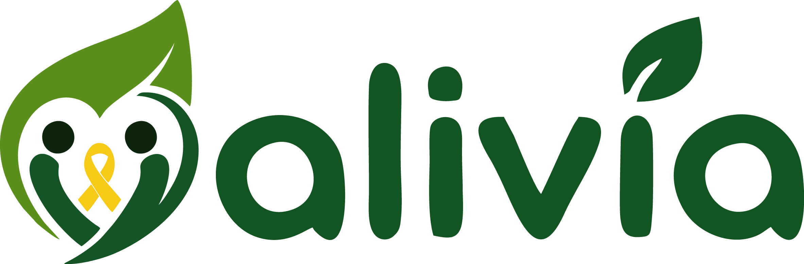
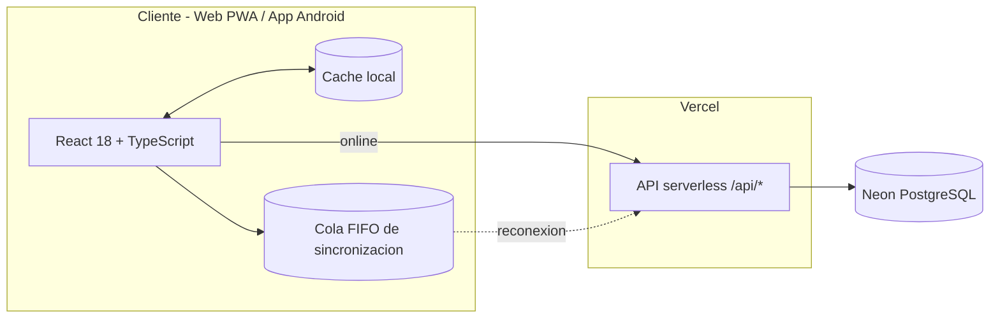

<div align="center">



### Tu espacio de calma — incluso a las 2 a.m., sin señal

**Refugio digital de bienestar mental para adolescentes y jóvenes.**
Respiración guiada · Diario terapéutico · Ayuda real en crisis · Offline-first

[](https://alivia-tu-salud.vercel.app)
[](https://github.com/Imandro/AliviaApp/releases/latest)
[](LICENSE)


</div>

> **Si estás en crisis:** esta app es una herramienta de apoyo y no sustituye ayuda profesional.
> Si tú o alguien está en riesgo, usen el botón **SOS** dentro de la app o contacten a las
> líneas de crisis gratuitas de su país (incluidas en la sección SOS de ALIVIA).

---

## Tabla de contenidos

- [Qué es ALIVIA](#qué-es-alivia)
- [Características](#características)
- [Arquitectura](#arquitectura)
- [Offline-first](#offline-first)
- [Inicio rápido](#inicio-rápido)
- [App Android](#app-android)
- [Variables de entorno](#variables-de-entorno)
- [API](#api)
- [Despliegue](#despliegue)
- [Estructura del proyecto](#estructura-del-proyecto)
- [Hoja de ruta](#hoja-de-ruta)
- [Contribuir](#contribuir)
- [Seguridad](#seguridad)
- [Equipo](#equipo)

## Qué es ALIVIA

ALIVIA acompaña la salud emocional de adolescentes y jóvenes con herramientas de
primera línea diseñadas para el peor momento: pantallas oscuras por defecto, cero
fricción hasta el alivio y el botón SOS siempre a un toque.

Una sola base de código React corre idéntica en tres experiencias:

| Experiencia | Estado | Detalle |
|---|---|---|
| **Web** (`alivia-tu-salud.vercel.app`) | Producción | SPA con service worker, instalable como PWA |
| **App Android nativa** | v1.0 firmada | Capacitor 8: ícono, splash y permisos propios |
| **PWA instalada** | iOS y Android | Al instalarse, la landing cede su lugar a la app |

## Características

| Módulo | Descripción |
|---|---|
| **Respiración guiada** | 3 protocolos (Box 4·4·4·4, Relajación 4-7-8, Coherente 5·5) con círculo animado y sonido sintetizado en vivo vía Web Audio API (ruido marrón, olas, ondas binaurales). |
| **Burn Journal** | Diario terapéutico: escribe lo que te abruma y obsérvalo disolverse en partículas. |
| **Afrontamiento** | 4 ejercicios guiados paso a paso con estadísticas y racha de días consecutivos. |
| **Tierra 5-4-3-2-1** | Técnica sensorial de conexión al presente, guiada por voz. |
| **Tarjetas de crisis** | Contenido validado para pánico, ganas de consumir, conflicto familiar y autolesión. |
| **SOS** | Líneas de crisis gratuitas (MX · CO · AR · US), emergencias y contacto seguro configurable. |
| **VIA (chat IA)** | Compañero conversacional que pregunta antes de aconsejar y lleva a la función correcta de la app; entrada por voz con transcripción Whisper. |
| **Comunidad anónima** | Posts por temas y apoyo entre pares, sin perfiles públicos. |
| **Chequeo de bienestar** | Escala de estrés, ansiedad y depresión cada 5 días con recomendaciones. |
| **Planes y retos** | Metas por área de vida con seguimiento de racha. |
| **Juegos de regulación** | 4 minijuegos diseñados para bajar revoluciones. |
| **Temas** | Calma Profunda (oscuro), Salvia Suave (claro) y monocromático. |

## Arquitectura



- **Un código, dos nativos:** el mismo build de Vite corre en navegador y dentro de un contenedor Capacitor 8 con icono, splash screen, permisos de micrófono y firma propia.
- **Backend serverless:** funciones `/api/*` en Node con `pg`, sesiones scrypt de 30 días y esquema autogestionado (`db/schema.sql`, `db/functions.sql`).

## Offline-first

ALIVIA no se apaga cuando se va la red. La capa de datos (`src/utils/apiClient.ts`) implementa:

1. **Lecturas con caché** — cada `GET` exitoso se guarda localmente; sin conexión se sirve la última respuesta conocida.
2. **Escrituras encoladas** — cada mutación fallida por red entra a una cola FIFO persistente.
3. **Sincronización automática** — al reconectar (evento `online`, apertura de la app o intervalo de 30 s) la cola se reenvía en orden; los errores 4xx se descartan, los fallos de red pausan el reintento.
4. **Revalidación silenciosa** — tras sincronizar, las lecturas clave se refrescan en segundo plano.
5. **UI honesta** — indicador discreto con cambios pendientes y confirmación de sincronización.

## Inicio rápido

```bash
git clone https://github.com/Imandro/AliviaApp.git
cd ALIVIA
npm install
npm run dev
```

Requisitos: Node.js 18+ y npm.

## App Android

La app nativa comparte el 100% del código web y se genera desde el mismo proyecto.

```bash
npm install @capacitor/core @capacitor/cli @capacitor/android
npm run sync:android        # build web + cap sync + limpieza de assets
cd android
./gradlew assembleRelease   # APK firmado
```

- **SDK:** Android 36 · **JDK:** 21 · `android/local.properties` apunta al SDK.
- **Firma:** crear `android/keystore.properties` (no se sube a git):

```properties
storeFile=keystore/alivia-release.jks
storePassword=TU_CLAVE
keyAlias=alivia
keyPassword=TU_CLAVE
```

El APK firmado queda en `android/app/build/outputs/apk/release/`.
Las descargas públicas se distribuyen vía [GitHub Releases](https://github.com/Imandro/AliviaApp/releases/latest).

## Variables de entorno

| Variable | Ámbito | Descripción |
|---|---|---|
| `DATABASE_URL` | Servidor (Vercel) | Cadena de conexión a Neon PostgreSQL con SSL. |
| `VITE_GROQ_API_KEY` | Build cliente | Llave de Groq para VIA (chat, transcripción y TTS alternativo). |

Nunca se commitean: `.env` y `.env.local` están en `.gitignore`.

## API

| Endpoint | Métodos | Descripción |
|---|---|---|
| `/api/auth/register` · `/login` · `/logout` | POST | Ciclo de sesión (scrypt + token Bearer 30 días). |
| `/api/auth/me` · `/profile` | GET · PUT | Usuario actual / edición de perfil. |
| `/api/moods` | GET · POST | Historial de ánimo diario (1-5). |
| `/api/contacts` | GET · PUT · DELETE | Contacto seguro de emergencia. |
| `/api/activities` | GET · POST | Ejercicios completados y racha. |
| `/api/posts` · `/posts/like` | GET · POST · DELETE | Comunidad anónima por temas. |
| `/api/plans` | GET · POST · PUT · DELETE | Planes, metas y actividades. |
| `/api/assessments` | GET · POST | Chequeos de bienestar y registro de contacto en crisis. |
| `/api/tts` | GET | Síntesis de voz (Edge WebSocket con respaldo). |

Todas las rutas responden CORS (`api/_cors.ts`) para consumo desde la app nativa.

## Despliegue

1. Crea el proyecto en Vercel (framework **Vite**) o usa la CLI: `npx vercel --prod`.
2. Configura `DATABASE_URL` en *Settings → Environment Variables*.
3. La app web y la API `/api/*` se despliegan juntas (`vercel.json`).
4. Landing pública en [`/landing`](https://alivia-tu-salud.vercel.app/landing); dentro de una PWA instalada redirige automáticamente a la app.

## Estructura del proyecto

```text
├── api/                  # Funciones serverless (Vercel + pg)
│   ├── _db.ts            #   Pool, esquema y funciones SQL
│   ├── _cors.ts          #   Cabeceras CORS compartidas
│   └── auth/             #   Registro, login, perfil, sesiones
├── db/                   # Esquema y funciones SQL de referencia
├── public/               # PWA: manifest, service worker, landing
│   ├── fonts/            #   Tipografía propia (Quicksand + Lato)
│   └── landing.html      #   Página del proyecto (Equipo DataStorm)
├── scripts/
│   └── post-sync.js      # Limpieza de assets tras cap sync
├── src/
│   ├── components/       # UI reutilizable
│   ├── views/            # Pantallas (Dashboard, Breathe, Chat, SOS...)
│   ├── games/            # Minijuegos de regulación
│   └── utils/
│       ├── apiClient.ts  # Motor offline-first (caché + cola FIFO)
│       ├── auth.ts       # Sesión y perfil con respaldo local
│       └── localDb.ts    # Datos con actualizaciones optimistas
└── android/              # Proyecto nativo generado por Capacitor
```

## Hoja de ruta

- [ ] Notificaciones locales de recordatorio de chequeo
- [ ] Exportación de historial personal (JSON/PDF)
- [ ] Modo acompañante: compartir racha con persona de confianza
- [ ] Publicación en Play Store (AAB firmado)
- [ ] iOS vía Capacitor

## Contribuir

1. Haz fork y crea tu rama: `git checkout -b feature/mi-funcion`
2. Commits claros y atómicos en español: `feat(respiracion): ...`, `fix(sync): ...`
3. Verifica antes de enviar: `npm run build` (typecheck + bundle)
4. Abre un Pull Request describiendo el problema que resuelve

## Seguridad

- Las contraseñas se almacenan con **scrypt** y las sesiones usan tokens Bearer con expiración de 30 días.
- `DATABASE_URL` y llaves de IA viven solo en variables de entorno; los binarios de firma (`*.jks`) nunca entran al repositorio.
- El contenido de crisis fue revisado contra fuentes oficiales (OMS y líneas nacionales). Reporta cualquier imprecisión abriendo un issue con la etiqueta `content`.

## Equipo

**DataStorm** — proyecto abierto construido con calma.

¿Te sirve ALIVIA o quieres adaptarla a tu comunidad?
Las contribuciones de contenido psicoeducativo, accesibilidad y traducciones son bienvenidas.

## Licencia

[MIT](LICENSE) — úsala, adáptala y compártela. Si alguien lo necesita, esto es para eso.
