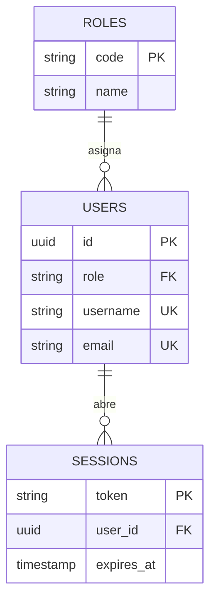
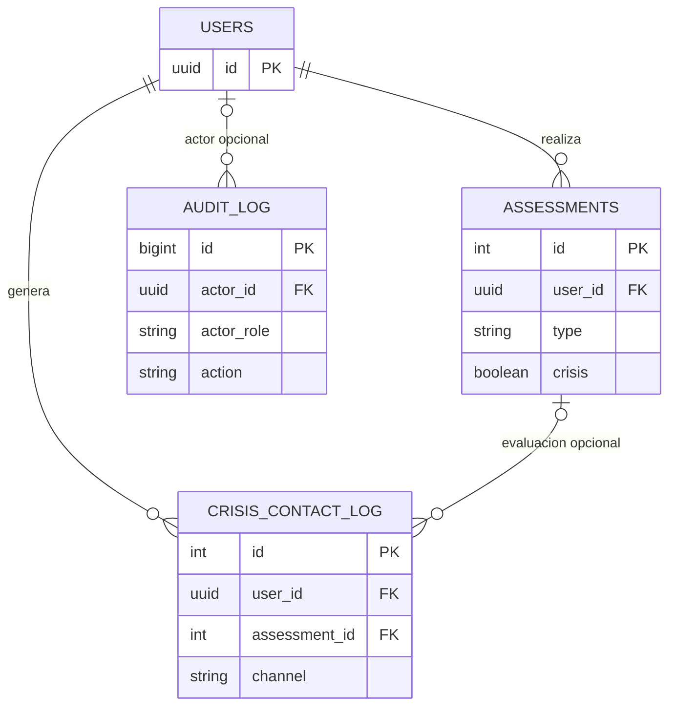
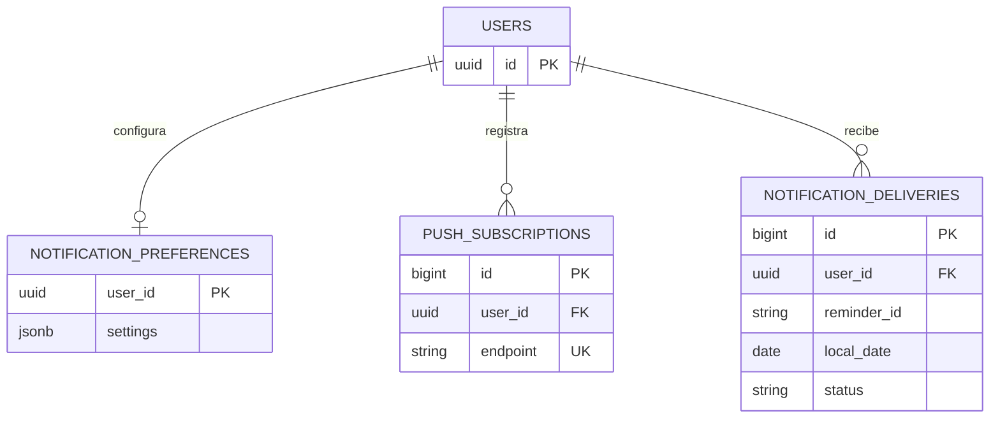
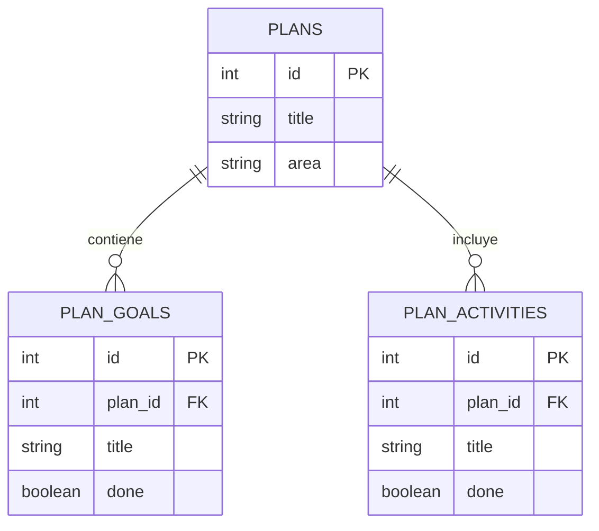

<div align="center">


### Refugio digital de bienestar mental para adolescentes y jóvenes

**Una sola base de código React. Web, Android e iOS. Cero dependencia de la señal.**

<br>

[](https://github.com/Imandro/AliviaApp/actions/workflows/ci.yml)
[](https://github.com/Imandro/AliviaApp/releases/latest)
[](LICENSE)
[](https://alivia.lat)


**[Abrir la web en Azure](https://57.156.61.193/)** ·
**[Descargar Android](https://alivia.lat/descarga.html)** ·
**[Landing del proyecto](https://alivia.lat/landing.html)** ·
**[Reportar un problema](https://github.com/Imandro/AliviaApp/issues)**

</div>

---

> [!IMPORTANT]
> **Si estás en crisis, esto no sustituye la ayuda profesional.**
> Usa el botón **SOS** dentro de la app para ver líneas de crisis gratuitas de tu país,
> o contacta a tu servicio local de emergencias. No estás solo.

---

## Qué es ALIVIA

**ALIVIA** es una aplicación de bienestar mental para adolescentes y jóvenes. Ofrece herramientas de primera línea — ejercicios de respiración, diario terapéutico, chequeos de bienestar, chat con IA empática (Livi), biblioteca de guías, juegos de regulación emocional y botón SOS con líneas de crisis — **todo funcionando 100 % offline** y sincronizando cuando hay conexión. Una sola base de código React sirve Web (PWA), Android nativo (Capacitor) e iOS nativo (Swift/WKWebView).

## Qué resuelve

| Problema | Solución en ALIVIA |
|---|---|
| **Ansiedad y pánico en el momento** | Respiración guiada (Box 4·4·4·4, 4-7-8, coherente 5·5), técnica Tierra 5-4-3-2-1 por voz, 4 ejercicios de afrontamiento paso a paso. |
| **Falta de espacio para desahogarse** | *Burn Journal*: escribe y observa tus pensamientos disolverse en partículas; todo local, privado y exportable. |
| **No saber cómo estás realmente** | Chequeo de bienestar cada 5 días (estrés, ansiedad, depresión) + **Radar de Bienestar** con gráficas de tendencia y rachas. |
| **Soledad y falta de apoyo** | Chat **Livi** (IA que pregunta *por qué* antes de aconsejar), **Conecta con alguien** (plantillas para pedir ayuda), comunidad anónima por temas. |
| **Crisis sin saber a quién llamar** | Botón **SOS** con líneas gratuitas de 6 países centroamericanos, contacto de emergencia configurable, detección de riesgo por niveles. |
| **Falta de hábitos y motivación** | 8 minijuegos de regulación, **Planes y Retos** con metas y rachas, 20 recordatorios locales + push, biblioteca interactiva con quiz. |
| **Privacidad y control de datos** | Bloqueo biométrico + cortina de privacidad, exportación JSON + HTML imprimible, i18n es/en, datos guardados primero en el dispositivo. |

## Contexto: Hackathon Kronox 2026

ALIVIA nace como proyecto para competir en la **categoría aficionado del Hackathon Nicaragua 2026 Kronox**. El reto: crear una solución tecnológica de impacto social con recursos limitados. Elegimos salud mental juvenil porque es una necesidad real, silenciosa y desatendida en nuestra región.

## Por qué existe

**1 de cada 7** adolescentes entre 10 y 19 años vive con un trastorno mental diagnosticable, y cerca de la mitad nunca recibe atención (OMS). La ansiedad no espera a que haya turno disponible: aparece a las 2 a.m., antes de un examen, después de una pelea en casa.

ALIVIA pone herramientas de primera línea exactamente ahí — en el bolsillo, sin esperas, sin estigma y sin depender de que haya internet.

## Cuatro experiencias, un código

| Experiencia | Estado | Detalle |
|---|---|---|
| Web responsive | Azure VM ([57.156.61.193](https://57.156.61.193/)) | SPA instalable como PWA; API en VM y base privada administrada en Azure |
| App Android nativa | APK en [alivia.lat/releases](https://alivia.lat/releases.json) y GitHub Releases · AAB listo para Play | Capacitor 8: ícono adaptativo, splash screen, permisos y firma propios |
| App iOS nativa | IPA ad-hoc / TestFlight | Shell Swift (WKWebView) propio con puente nativo: biometría, hápticos, notificaciones, cortina de privacidad |
| PWA instalada | iOS / Android | Al instalarse, el modo standalone redirige todo a la app |

El mismo bundle de Vite corre en las cuatro: no hay código duplicado ni pantallas que se porten a medias.

---

## Stack Tecnológico

| Capa | Tecnologías |
|---|---|
| **Frontend** | React 18, TypeScript 5.6, Vite 5, React Router, Lucide icons |
| **Nativo Android** | Capacitor 8, Gradle 8, JDK 21, Android SDK 36 |
| **Nativo iOS** | Swift, WKWebView, XcodeGen (project.yml) |
| **Backend web Azure** | Node.js 22 HTTP en VM, Azure Database for PostgreSQL 16 Flexible Server, pg driver |
| **Infraestructura web Azure** | VM Ubuntu 22.04.5 LTS, nginx, systemd, NSG, HTTPS con Certbot |
| **Infraestructura histórica AWS** | Lambda, RDS PostgreSQL 16, S3, CloudFront; despliegue manual separado |
| **IA / Voz** | OpenAI (gpt-4.1-mini), Groq (Whisper), ElevenLabs (TTS), Edge TTS, Google TTS |
| **Testing / Calidad** | Vitest (141 tests), TypeScript strict, ESLint + Prettier |

---

## Modelo Entidad-Relación (BD Relacional - 3FN)

El esquema está normalizado hasta la **Tercera Forma Normal (3FN)**, superando el requisito de 2FN. Todas las tablas tienen clave primaria, no hay dependencias parciales ni transitivas, y las relaciones se modelan con claves foráneas explícitas.

El modelo se divide en dos vistas para mantener legibles las relaciones. Se muestran las claves y los campos principales; las relaciones corresponden a las claves foráneas de `db/schema.sql`.

### Identidad y sesiones


```mermaid
erDiagram
    ROLES ||--o{ USERS : "asigna"
    USERS ||--o{ SESSIONS : "abre"

    ROLES {
        string code PK
        string name
    }
    USERS {
        uuid id PK
        string role FK
        string username UK
        string email UK
    }
    SESSIONS {
        string token PK
        uuid user_id FK
        timestamp expires_at
    }
```

### Evaluaciones y registros


```mermaid
erDiagram
    USERS ||--o{ ASSESSMENTS : "realiza"
    USERS o|--o{ AUDIT_LOG : "actor opcional"
    USERS ||--o{ CRISIS_CONTACT_LOG : "genera"
    ASSESSMENTS o|--o{ CRISIS_CONTACT_LOG : "evaluacion opcional"

    USERS {
        uuid id PK
    }
    ASSESSMENTS {
        int id PK
        uuid user_id FK
        string type
        boolean crisis
    }
    CRISIS_CONTACT_LOG {
        int id PK
        uuid user_id FK
        int assessment_id FK
        string channel
    }
    AUDIT_LOG {
        bigint id PK
        uuid actor_id FK
        string actor_role
        string action
    }
```

### Notificaciones


```mermaid
erDiagram
    USERS ||--o| NOTIFICATION_PREFERENCES : "configura"
    USERS ||--o{ PUSH_SUBSCRIPTIONS : "registra"
    USERS ||--o{ NOTIFICATION_DELIVERIES : "recibe"

    USERS {
        uuid id PK
    }
    NOTIFICATION_PREFERENCES {
        uuid user_id PK
        jsonb settings
    }
    PUSH_SUBSCRIPTIONS {
        bigint id PK
        uuid user_id FK
        string endpoint UK
    }
    NOTIFICATION_DELIVERIES {
        bigint id PK
        uuid user_id FK
        string reminder_id
        date local_date
        string status
    }
```

### Contenido global y planes

Las tablas de contenido no tienen una clave foránea a `users`. Los planes se relacionan únicamente con sus metas y actividades.


```mermaid
erDiagram
    PLANS ||--o{ PLAN_GOALS : "contiene"
    PLANS ||--o{ PLAN_ACTIVITIES : "incluye"

    PLANS {
        int id PK
        string title
        string area
    }
    PLAN_GOALS {
        int id PK
        int plan_id FK
        string title
        boolean done
    }
    PLAN_ACTIVITIES {
        int id PK
        int plan_id FK
        string title
        boolean done
    }
```

| Tabla independiente | Clave primaria | Campos principales |
|---|---|---|
| `mood_entries` | `date` | `score`, `note` |
| `emergency_contact` | `id` | `name`, `phone` |
| `completed_activities` | (`id`, `date`) | `title`, `completed_at` |
| `community_posts` | `id` | `author`, `content`, `topic`, `likes` |

> **Notas de normalización:**  
> - **1FN:** Atributos atómicos (arrays `TEXT[]` son nativos de PostgreSQL).  
> - **2FN:** Sin dependencias parciales — claves compuestas dependen totalmente de su PK.  
> - **3FN:** Sin dependencias transitivas — `users.role` apunta a catálogo `roles` (FK), no a otra columna no-clave.  
> - **Integridad referencial:** FK con `ON DELETE CASCADE`/`SET NULL`; `roles` es catálogo cerrado.

---

## Arquitectura actual de la web en Azure

```text
Navegador -> HTTPS 57.156.61.193:443 -> nginx (VM vm-alivia)
                                      |-- dist/ (React + Vite)
                                      |-- /api/* -> Node.js 127.0.0.1:8080
                                                       -> TLS + red privada -> Azure PostgreSQL 16
                                                       -> base alivia_azure
```

La web utiliza peticiones relativas `/api/*`, que se resuelven contra la IP pública de Azure. La API y PostgreSQL no exponen sus puertos internos a internet. Esta base se creó vacía por decisión del equipo: no contiene los datos ni las cuentas anteriores de AWS.

El APK publicado y el shell iOS conservan su configuración previa de API. IA, voz de proveedores y notificaciones requieren configurar sus claves y validar esas funciones en Azure; los envíos externos están desactivados por defecto.

### Arquitectura histórica de AWS

```
Cliente (Web PWA / Android / iOS)          AWS Cloud
┌─────────────────────────────────┐        ┌─────────────────────────┐
│ React 18 + TypeScript (Vite)    │        │ CloudFront + Lambda     │
│  ├── Caché local (lecturas)     │◄──────►│  ├── alivia-api (VPC)   │
│  └── Cola FIFO (escrituras)     │        │  ├── alivia-ai (SSE)    │
└─────────────────────────────────┘        │  ├── alivia-tts (voz)   │
                                           │  └── EventBridge (cron) │
                                           └───────────┬─────────────┘
                                                       ▼
                                              ┌─────────────────┐
                                              │ RDS PostgreSQL  │
                                              │    (esquema)    │
                                              └─────────────────┘
```

- **Un código, tres nativos**: mismo bundle en navegador, Capacitor (Android) y Swift (iOS).
- **Backend serverless**: Lambdas Node con `pg`, contraseñas **scrypt**, sesiones Bearer 30 días.
- **Seguridad IA**: rate limit por IP, temperaturas acotadas, `system` message forzado.
- **Offline-first**: lecturas con caché, escrituras encoladas (FIFO), sincronización automática al reconectar.

---

## Interfaces y Desarrollo (100%)

22 pantallas totalmente navegables y funcionales:

| Categoría | Vistas |
|---|---|
| **Inmediatas** | Dashboard, Respiración (Box, 4-7-8, Coherente), Tierra 5-4-3-2-1, Tarjetas de crisis, SOS, Afrontamiento |
| **Diarias** | Burn Journal, Chequeo bienestar, Radar bienestar, Planes y retos, Comunidad anónima, 8 Juegos sensoriales |
| **Acompañamiento** | Chat Livi (IA + voz), Biblioteca inteligente, Conecta con alguien, Alertas MINSA-SILAIS, Recordatorios, Onboarding |
| **Privacidad** | Bloqueo biométrico, Exportar datos (JSON/HTML), Temas, Idioma |
| **Admin** | Panel administración (usuarios, bitácora, métricas) — gated por roles |

Todas las vistas tienen formularios funcionales, navegación bottom-bar, y funcionan offline.

---

## Inicio Rápido

**Requisitos:** Node.js 18+ y npm.

```bash
git clone https://github.com/Imandro/AliviaApp.git
cd AliviaApp
npm install
npm run dev          # http://localhost:5173 (Vite + HMR)
npm test             # 141 tests Vitest
npm run build        # typecheck + bundle producción
npm run preview      # vista previa del build
```

### Android
```bash
npm run sync:android  # build web + cap sync
cd android
./gradlew assembleDebug     # APK prueba
./gradlew assembleRelease   # APK firmado (requiere keystore)
./gradlew bundleRelease     # AAB para Play Store
```

### iOS
```bash
npm run sync:ios      # build web iOS + copia a ios/Web
cd ios && xcodegen    # genera Alivia.xcodeproj
open Alivia.xcodeproj # compila y firma en Xcode
```

---

## Testing y Calidad

| Comando | Qué hace |
|---|---|
| `npm test` | 141 tests Vitest (roles, offline, crisis, TTS, IA, export, auth, RBAC) |
| `npm run typecheck` | TypeScript strict mode — cero `any` |
| `npm run lint` | ESLint + Prettier — commits convencionales, imports ordenados |
| `npm run build` | Vite: typecheck + minify + tree-shaking + hash assets |

---

## API (Endpoints Principales)

| Endpoint | Métodos | Descripción |
|---|---|---|
| `/api/auth/register · /login · /logout` | POST | Ciclo de sesión (scrypt + Bearer 30d) |
| `/api/auth/me · /profile` | GET · PUT | Usuario actual / editar perfil |
| `/api/moods` | GET · POST | Historial de ánimo (1-5) |
| `/api/contacts` | GET · PUT · DELETE | Contacto de emergencia |
| `/api/activities` | GET · POST | Ejercicios completados y racha |
| `/api/posts · /posts/like` | GET · POST · DELETE | Comunidad anónima por temas |
| `/api/plans` | GET · POST · PUT · DELETE | Planes, metas, actividades |
| `/api/assessments` | GET · POST | Chequeos bienestar + contacto crisis |
| `/api/notifications/*` | GET · POST · PUT | Preferencias, suscripciones push, dispatch |
| `/api/tts` | GET | Síntesis voz (ElevenLabs → Edge → Google) |
| `/api/ai/chat` | POST | Proxy IA Livi (SSE streaming) |
| `/api/ai/transcribe` | POST | Transcripción voz (Whisper) |
| `/api/admin/users` | GET · PATCH | Gestión cuentas (rol **admin**) |
| `/api/admin/audit` | GET | Bitácora acciones (rol **admin/auditor**) |
| `/api/admin/stats` | GET | Métricas agregadas (rol **admin/auditor**) |

---

## Seguridad y Roles (100%)

Tres roles definidos en BD (`roles` catálogo) y código (`api/auth/_roles.ts`, `src/utils/roles.ts`):

| Rol | Permisos | Restricciones |
|---|---|---|
| **usuario** (default) | `app.use` — usar app con sus datos | No ve panel admin, no toca cuentas ajenas |
| **admin** | `app.use`, `users.manage`, `stats.view`, `audit.read` | No puede cambiarse su propio rol ni desactivarse |
| **auditor** | `app.use`, `stats.view`, `audit.read` | Solo lectura — nunca muta datos |

**Cómo se garantiza el 100%:**
- **Matriz de permisos** (no `if role === 'admin'` sueltos): handlers usan `requirePermission()` → 401 sin sesión, 403 sin permiso.
- **Defensa en profundidad**: BD re-valida en `fn_admin_update_user`; ni bug ni `UPDATE` directo escalan privilegios.
- **Auditoría transaccional**: cambios de rol/estado escriben en `audit_log` en la misma transacción (`fn_log_audit`).
- **Desactivar = cerrar sesión**: borra sesiones y token deja de resolver; login distingue 401 (credenciales) vs 403 (cuenta desactivada).
- **Sin auto-escalada**: registro nunca acepta `role` del cliente; toda cuenta nace `usuario`.

---

## Estructura del Proyecto

```text
├── api/                  # API Node.js Azure y handlers históricos AWS
│   ├── _db.ts            # Pool, esquema, funciones SQL
│   ├── auth/             # Registro, login, sesiones, roles
│   ├── admin/            # Panel: usuarios, bitácora, métricas
│   ├── notifications/    # Recordatorios, push, cron dispatch
│   ├── tts.ts            # Síntesis voz (triple motor)
│   └── ai.ts             # Proxy IA (failover, rate limit, SSE)
├── db/                   # schema.sql + functions.sql (referencia)
├── infra/                # CloudFormation/SAM: net, db, app, web
├── ios/                  # Shell Swift (WKWebView) + XcodeGen
├── public/               # fonts, landing.html, descarga.html
├── scripts/              # build-lambda, ios-sync, post-sync
├── .github/workflows/    # CI, deploy-azure-vm (OIDC), AWS manual, ios-build
├── src/
│   ├── components/       # UI reutilizable (Header, Nav, SyncToast, AppLock…)
│   ├── views/            # 22 pantallas (Dashboard, Breathe, Chat, SOS, Radar…)
│   ├── games/            # 8 juegos sensoriales sin meta
│   ├── i18n.ts           # Diccionarios es/en
│   └── utils/            # apiClient, aiProvider, crisisSafety, exportData, appLock, auth…
└── android/              # Capacitor 8 generado
```

---

## Control de Versiones

Evidencia en GitHub del flujo completo previo al evento:

| Comando | Evidencia |
|---|---|
| `git commit` | [Historial legible](https://github.com/Imandro/AliviaApp/commits/main) — convencionales, atómicos, en español |
| `git push` | Push a `origin/main` tras cada PR mergeado (ej. PR #31, #30) |
| `git pull --rebase` | Rebase automático antes de integrar remotos (`reflog` lo confirma) |
| `git merge` | Merge de PRs vía GitHub (ej. `Merge pull request #31...`) |

**Workflow:** Rama feature → commits atómicos → PR → review → merge (squash/rebase) → push a main → deploy auto (GitHub Actions OIDC). Sin commits directos a `main`.

---

## Ejecución y Demostración

El sistema se ejecuta localmente sin errores:

```bash
git clone https://github.com/Imandro/AliviaApp.git
cd AliviaApp
npm install
npm run dev          # desarrollo en http://localhost:5173
npm test             # 141 tests pasan
npm run build        # build producción
npm run preview      # vista previa build
```

**Evidencia de operatividad:** [Video de navegación completa](https://github.com/Imandro/AliviaApp/wiki/Demo) — recorre Dashboard, Respiración, Burn Journal, Chequeo, Radar, Chat Livi, SOS, Biblioteca, Planes, Comunidad, Juegos, Admin (roles), Perfil, Onboarding, offline-first sync, biometría, exportación JSON/HTML.

---

## Despliegue actual en Azure

| Recurso | Configuración |
|---|---|
| Suscripción | Azure for Students |
| Grupo de recursos | `ALIVIA-RG-CL` |
| VM / región | `vm-alivia` / Chile Central |
| Sistema operativo | Ubuntu 22.04.5 LTS |
| URL pública | https://57.156.61.193/ |
| Servicio de API | `alivia-azure-api.service`, usuario Linux `alivia_azure` |
| Servidor de base de datos | Azure Database for PostgreSQL Flexible Server `pg-alivia-20261009`, PostgreSQL 16, Chile Central |
| Base de datos | `alivia_azure`; datos trasladados desde PostgreSQL de la VM, conservando tablas, registros y secuencias |
| Red de base de datos | Subred privada `snet-postgres` (`10.1.2.0/24`) en `vnet-alivia`, DNS privado y acceso público deshabilitado |
| Tamaño / respaldos | Burstable `Standard_B1ms`, almacenamiento 32 GiB, retención de backups 7 días |
| Release activo | `/opt/alivia-azure/current` apunta a `/opt/alivia-azure/releases/<SHA>` |
| Puertos públicos | 80 para redirección y renovación de certificado; 443 para HTTPS |
| SSH | 22 restringido a IP de acceso específicas; actualizar la regla si cambia la red |
| Puertos privados | API 8080 en `127.0.0.1`; PostgreSQL 5432 solo por la red privada Azure |

### Preparación de la VM

Requiere Node.js 22, npm, nginx, PostgreSQL 14 o superior y acceso administrativo a la VM. Ejecutar `sudo bash scripts/bootstrap-vm-azure.sh` una vez crea el usuario/base nuevos y obtiene el certificado para la IP. Este script no borra bases existentes. El certificado usa renovación automática; la VM debe estar encendida y el puerto 80 accesible para las validaciones.

La API se conecta a `pg-alivia-20261009.postgres.database.azure.com` por la red privada usando el rol de aplicación `alivia_app` y TLS con verificación de certificado y nombre del servidor. La conexión está en `/etc/alivia-azure/database.env`, propiedad de root y permisos `600`, fuera del repositorio:

```dotenv
DATABASE_TLS_MODE=verify-full
DATABASE_URL=postgresql://alivia_app:<PASSWORD_URL_ENCODED>@pg-alivia-20261009.postgres.database.azure.com:5432/alivia_azure
```

`scripts/deploy-vm-azure.sh` carga ese archivo después de la configuración local inicial. Por tanto, cada actualización de `main` conserva la conexión al servicio administrado. Los secretos no se guardan en GitHub. La base PostgreSQL 14 original permanece en la VM como respaldo del traslado; no recibe nuevas escrituras de la aplicación. `bootstrap-vm-azure.sh` prepara la VM con una base local inicial y no crea el servicio administrado.

Para encontrar la base en el portal: **Azure Database for PostgreSQL Flexible Servers → pg-alivia-20261009 → Bases de datos → alivia_azure**. El portal muestra el recurso, su red, versión, métricas y backups. Para consultar tablas y registros por SQL hay que conectarse desde la red privada (por ejemplo, mediante la VM); no se abre el puerto 5432 al público.

Los secretos de proveedores, cuando se configuren, deben almacenarse fuera del repositorio en la VM, mediante un archivo de entorno protegido.

### GitHub main -> VM Azure

El workflow [Deploy app to Azure VM](.github/workflows/deploy-azure-vm.yml) se ejecuta al actualizar `main`. Usa las variables Actions `AZURE_CLIENT_ID`, `AZURE_TENANT_ID` y `AZURE_SUBSCRIPTION_ID` y autenticación OIDC. La identidad necesita el rol **Virtual Machine Contributor**, limitado al recurso `vm-alivia`, para ejecutar el despliegue por Azure Run Command. No necesita una clave privada SSH ni contraseña en GitHub.

Antes de desplegar ejecuta `npm ci`, builds web/API/Lambda y tests. Después descarga del repositorio el commit exacto `github.sha`, compila en la VM, reinicia la API y recarga nginx. La base persiste entre despliegues. Los workflows históricos de AWS y Container Apps quedan disponibles solo mediante ejecución manual; los PR conservan las validaciones requeridas.

### Comprobar que Azure ejecuta el mismo commit que main

```bash
git fetch origin main
git rev-parse origin/main
curl --fail https://57.156.61.193/healthz
curl --fail https://57.156.61.193/readyz
```

El campo `revision` de `/healthz` debe coincidir con el SHA de `origin/main`; `/readyz` debe devolver `status: ready`. Dentro de la VM también se puede leer `/opt/alivia-azure/current/SOURCE_COMMIT`. Cada release se obtiene de GitHub por ese SHA, incluyendo el README y los scripts utilizados.

Antes de activar el release, `scripts/verify-source.mjs` compara el hash Git de **cada archivo versionado** con el árbol del commit en GitHub. El despliegue se detiene si hay diferencias. La prueba queda en `/opt/alivia-azure/current/SOURCE_VERIFICATION.json`; `dist/`, `dist-api/` y `node_modules/` son resultados generados y no forman parte del código versionado.

Para publicar manualmente un commit de `main` desde la VM:

```bash
sudo bash scripts/deploy-vm-azure.sh <SHA_COMPLETO_DE_MAIN>
```

El dominio `alivia.lat` y la instalación anterior de Container Apps siguen siendo destinos separados; no se cambió su DNS al publicar esta VM. La evidencia de esta entrega usa la URL pública de la VM.

## Despliegue histórico en AWS (manual)

```bash
# 1. Red
aws cloudformation deploy --template-file infra/net.yaml --stack-name alivia-net

# 2. Base de datos
aws cloudformation deploy --template-file infra/database.yaml --stack-name alivia-db \
  --parameter-overrides DatabasePassword=<password>

# 3. Lambdas (api, ai, tts) + EventBridge cron
npm run build:lambda
sam build --template-file infra/app.yaml --build-dir .aws-sam/build-app
sam deploy --template-file .aws-sam/build-app/template.yaml --stack-name alivia-app --region us-east-1 \
  --parameter-overrides DatabasePassword=<password> GitHubOwner=<owner> GitHubRepo=<repo> \
  --capabilities CAPABILITY_IAM CAPABILITY_NAMED_IAM --resolve-s3

# 4. Web (S3 + CloudFront)
aws cloudformation deploy --template-file infra/web.yaml --stack-name alivia-web
```

El workflow histórico **Deploy to AWS** (`.github/workflows/deploy-aws.yml`) solo despliega mediante `workflow_dispatch`, con OIDC (`AWS_ROLE_ARN`). En los PR sigue validando la infraestructura, sin desplegar. Actualizar `main` publica la instalación actual en la VM de Azure.

---

## Variables de Entorno (Resumen)

| Variable | Dónde | Para qué |
|---|---|---|
| `DATABASE_URL` | Lambda `alivia-api` | Conexión RDS PostgreSQL |
| `OPENAI_API_KEY` | Lambda `alivia-ai` | Chat Livi (Secrets Manager) |
| `GROQ_API_KEY` | Lambda `alivia-ai` | Whisper voz (Secrets Manager) |
| `ELEVENLABS_API_KEY` | Lambda `alivia-tts` | Voz Livi (Secrets Manager) |
| `CRON_SECRET · VAPID_*` | Lambda `alivia-api` | Push web + cron dispatch |
| `VITE_API_URL · VITE_TTS_URL` | Build nativo iOS/Android | Orígenes absolutos para shells nativos |

**Nunca se commitean:** `.env`, `.env.local`, `*.jks`, `keystore.properties` (en `.gitignore`).

---

## Seguridad y Privacidad

- Contraseñas **scrypt**; sesiones Bearer 30 días.
- Secretos solo en variables de entorno y Secrets Manager; **ninguna clave de proveedor llega al bundle** (cliente usa `/api/ai/*` y `/api/tts`).
- Rate limit por IP, temperaturas acotadas, `system` message forzado en proxy IA.
- Sin anuncios ni perfiles públicos: comunidad anónima moderada por temas.
- Datos personales **primero en dispositivo**; nube recibe lo mínimo para sincronizar.
- Bloqueo biométrico + cortina de privacidad opcionales; exportación total en cualquier momento.

### Qué sale del dispositivo

- **Chat Livi** → viaja a OpenAI (proveedor externo) para contexto; mensajes de riesgo se marcan antes de enviar.
- **Todo lo demás** (ánimo, diario, planes, contactos, posts) → se guarda en dispositivo y solo sincroniza lo que el usuario registra.
- **Voz** → transcripción en Groq (`whisper-large-v3-turbo`), no se conserva en servicios propios.
- **Conversaciones** → guardadas en dispositivo (`alivia-chat-v1`), nunca en servidor.

---

## Equipo: DataStorm

**DataStorm** — Estudiantes de la **UNAN León** (Universidad Nacional Autónoma de Nicaragua, León), **Centro Universitario Regional (CUR) Somoto**.

| Integrante | Rol | Redes |
|---|---|---|
| **Zayri Azriel Wilson Sanchez** | Líder y diseñador | [@zayriaz](https://instagram.com/zayriaz) · [GitHub](https://github.com/ZAyriaz28) |
| **Mario Alejandro Ruiz Alvarez** | Comunicador y desarrollador | [@_imandro](https://instagram.com/_imandro) · [TikTok](https://tiktok.com/@_imandro) · [Web](https://_imandro.dev) |
| **Freddy Jonathan Rivera Reyes** | Desarrollador Frontend | [@dy.jona_g](https://instagram.com/dy.jona_g) · [GitHub](https://github.com/Jonax17) |
| **Erika Massiel Padilla Davila** | Marketing y creadora visual | [@___MASI_M](https://instagram.com/___MASI_M) |
| **Pablo Antonio Sanchez Espinoza** | Supervisor marketing y editor | [@sanchez_pab](https://instagram.com/sanchez_pab) |

Construimos ALIVIA con calma, código limpio y foco en el usuario real: adolescentes y jóvenes de Nicaragua y Centroamérica que necesitan herramientas de salud mental accesibles, privadas y que funcionen sin internet.

> **Proyecto abierto.** Si ALIVIA te sirve, adáptala a tu comunidad — para eso es libre.

[](https://github.com/Imandro/AliviaApp)

---

## Licencia

[MIT](LICENSE) © Equipo DataStorm

<div align="center">
<sub>ALIVIA no sustituye la atención profesional. Si hay riesgo, contacta ayuda inmediata.</sub>
</div>
