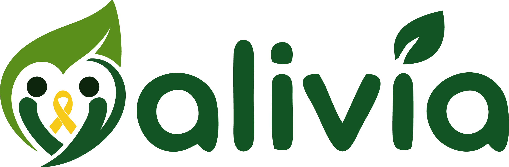
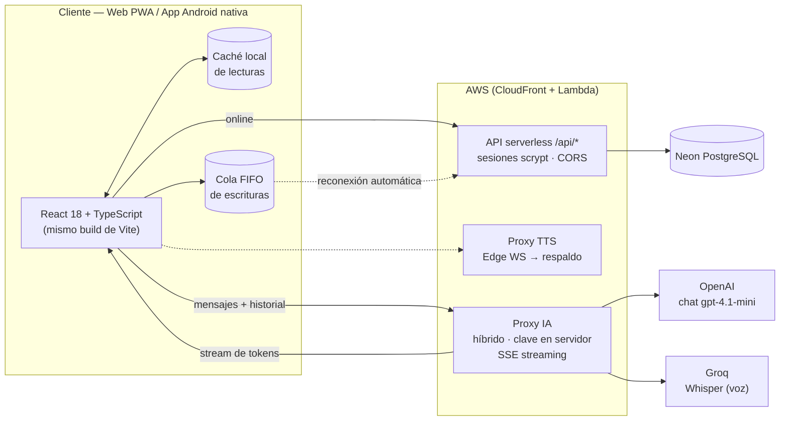
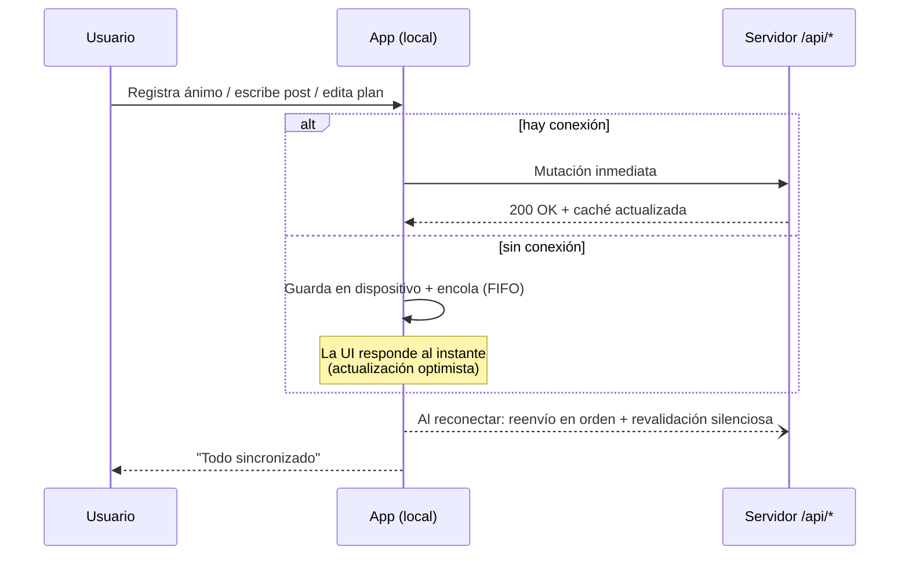

<div align="center">



### Refugio digital de bienestar mental para adolescentes y jóvenes

**Una sola base de código React. Tres experiencias nativas. Cero dependencia de la señal.**

<br>

[](https://github.com/Imandro/AliviaApp/actions/workflows/ci.yml)
[](https://github.com/Imandro/AliviaApp/releases/latest)
[](LICENSE)
[](https://d3gm2ziao5tkw0.cloudfront.net)


**[Abrir la web](https://d3gm2ziao5tkw0.cloudfront.net)** ·
**[Descargar Android](https://github.com/Imandro/AliviaApp/releases/latest/download/ALIVIA-1.0.apk)** ·
**[Landing del proyecto](https://d3gm2ziao5tkw0.cloudfront.net/landing)** ·
**[Reportar un problema](https://github.com/Imandro/AliviaApp/issues)**

</div>

---

> [!IMPORTANT]
> **Si estás en crisis, esto no sustituye la ayuda profesional.**
> Usa el botón **SOS** dentro de la app para ver líneas de crisis gratuitas de tu país,
> o contacta a tu servicio local de emergencias. No estás solo.

---

## Por qué existe

**1 de cada 7** adolescentes entre 10 y 19 años vive con un trastorno mental diagnosticable, y cerca de la mitad nunca recibe atención (OMS). La ansiedad no espera a que haya turno disponible: aparece a las 2 a.m., antes de un examen, después de una pelea en casa.

ALIVIA pone herramientas de primera línea exactamente ahí — en el bolsillo, sin esperas, sin estigma y sin depender de que haya internet.

## Tres experiencias, un código

| Experiencia | Estado | Detalle |
|---|---|---|
| Web responsive | Producción | SPA instalable como PWA (manifest + service worker) |
| App Android nativa | v1.0 firmada | Capacitor 8: ícono adaptativo, splash screen y permisos propios |
| PWA instalada | iOS / Android | Al instalarse, el modo standalone redirige todo a la app |

## Características

### En el momento — calma inmediata

| Módulo | Descripción |
|---|---|
| **Respiración guiada** | Box 4·4·4·4, Relajación 4-7-8 y Coherente 5·5. Círculo animado y mezclador de sonido sintetizado en tiempo real con Web Audio API (ruido marrón, olas, ondas binaurales): nada pregrabado. |
| **Tierra 5-4-3-2-1** | Técnica sensorial guiada por voz para volver al presente. |
| **Tarjetas de crisis** | Contenido validado para pánico, ganas de consumir, conflicto familiar y autolesión. |
| **SOS** | Líneas de crisis gratuitas (NI · CR · HN), emergencias y contacto seguro configurable a un toque. |
| **Reset frío · Pausa somática · Surfear la urgencia** | Cuatro ejercicios de afrontamiento paso a paso. |

### Todos los días — construir bienestar

| Módulo | Descripción |
|---|---|
| **Burn Journal** | Diario terapéutico: escribe lo que te abruma y obsérvalo disolverse en partículas. |
| **Chequeo de bienestar** | Escala de estrés, ansiedad y depresión cada 5 días, con recomendaciones personalizadas. |
| **Planes y retos** | Metas por área de vida con racha de días consecutivos. |
| **Comunidad anónima** | Posts por temas y apoyo entre pares, sin perfiles públicos ni exposición. |
| **Juegos de regulación** | 4 minijuegos diseñados para bajar revoluciones (burbujas, memoria, secuencia, tierra). |

### Acompañamiento

| Módulo | Descripción |
|---|---|
| **VIA (chat IA)** | Compañero conversacional empático: pregunta *por qué* te sientes así antes de aconsejar y te lleva directo a la función correcta de la app. Responde token a token, con entrada por voz (Whisper). Detecta señales de crisis y cambia de modo: en crisis baja la temperatura, pide ayuda humana de forma directa y ofrece SOS. Si la IA falla, responde igual con reglas locales. |
| **Temas** | Calma Profunda (oscuro), Salvia Suave (claro) y monocromático, con transiciones suaves. |

## Arquitectura


```mermaid
flowchart LR
    subgraph Cliente["Cliente — Web PWA / App Android nativa"]
        UI["React 18 + TypeScript<br/>(mismo build de Vite)"]
        CACHE[("Caché local<br/>de lecturas")]
        OUTBOX[("Cola FIFO<br/>de escrituras")]
        UI <--> CACHE
        UI --> OUTBOX
    end

    subgraph Nube["AWS (CloudFront + Lambda)"]
        API["API serverless /api/*<br/>sesiones scrypt · CORS"]
        TTS["Proxy TTS<br/>Edge WS → respaldo"]
        AI["Proxy IA<br/>híbrido · clave en servidor<br/>SSE streaming"]
    end

    DB[("Neon PostgreSQL")]
    OAI["OpenAI<br/>chat gpt-4.1-mini"]
    GROQ["Groq<br/>Whisper (voz)"]

    UI -- "online" --> API
    OUTBOX -.->|"reconexión automática"| API
    UI -.-> TTS
    UI -- "mensajes + historial" --> AI
    AI -- "stream de tokens" --> UI
    AI --> OAI
    AI --> GROQ
    API --> DB
```

> La IA viaja por una función aparte (`alivia-ai`) porque necesita salir a internet, y la
> API de datos vive dentro del VPC para llegar a la base de datos. Igual que el TTS, evitar
> un NAT Gateway. Las claves se leen de Secrets Manager: nunca entran en el bundle.

- **Un código, dos nativos:** el mismo bundle corre en navegador y dentro del contenedor Capacitor (`android/`), con icono adaptativo, splash, permiso de micrófono y firma release propia.
- **Backend serverless:** funciones Node en AWS Lambda con `pg`, contraseñas **scrypt**, sesiones Bearer de 30 días y esquema autogestionado (`db/schema.sql` + `db/functions.sql`).
- **Tipografía y assets propios:** Quicksand variable + Lato auto-hospedadas; sin CDNs externos.

## Offline-first

La app no se apaga cuando se va la red. `src/utils/apiClient.ts` implementa:


```mermaid
sequenceDiagram
    participant U as Usuario
    participant A as App (local)
    participant S as Servidor /api/*

    U->>A: Registra ánimo / escribe post / edita plan
    alt hay conexión
        A->>S: Mutación inmediata
        S-->>A: 200 OK + caché actualizada
    else sin conexión
        A->>A: Guarda en dispositivo + encola (FIFO)
        Note over A: La UI responde al instante<br/>(actualización optimista)
    end
    A--)S: Al reconectar: reenvío en orden + revalidación silenciosa
    A-->>U: "Todo sincronizado"
```

1. **Lecturas con caché** — cada `GET` exitoso se persiste; sin red se sirve la última respuesta conocida.
2. **Escrituras encoladas** — las mutaciones fallidas por red entran a una cola FIFO persistente.
3. **Sincronización automática** — al reconectar (`online`, apertura de la app o intervalo de 30 s); errores 4xx se descartan, fallos de red pausan el reintento.
4. **Revalidación silenciosa** — tras sincronizar se refrescan las lecturas clave en segundo plano.
5. **UI honesta** — indicador discreto con cambios pendientes y confirmación visual.

## Rendimiento y calidad

| Métrica | Valor |
|---|---|
| Bundle web (gzip) | ~180 KB JS + 4.4 KB CSS |
| APK firmado | ~3.6 MB |
| Paridad web ↔ app | 100 % (mismo build) |
| Fuentes | Auto-hospedadas, 0 peticiones a CDNs |
| CI | Typecheck + build en cada push/PR |
| Dependencias runtime | React, React Router, Lucide, pg, Capacitor |

## Inicio rápido

**Requisitos:** Node.js 18+ y npm.

```bash
git clone https://github.com/Imandro/AliviaApp.git
cd AliviaApp
npm install
npm run dev          # servidor de desarrollo en Vite
```

Build de producción (typecheck + bundle): `npm run build` · Vista previa: `npm run preview`.

## App Android

La app nativa comparte el 100 % del código web. Requisitos: **JDK 21**, **Android SDK 36** (`android/local.properties` apunta al SDK) y las dependencias de Capacitor ya incluidas.

```bash
npm install @capacitor/core @capacitor/cli @capacitor/android   # si aún no están
npm run sync:android        # build web + cap sync + limpieza de assets
cd android
./gradlew assembleDebug     # APK de prueba
./gradlew assembleRelease   # APK firmado (requiere keystore)
./gradlew bundleRelease     # AAB para Play Store
```

**Firma release:** crea `android/keystore.properties` (excluido de git):

```properties
storeFile=keystore/alivia-release.jks
storePassword=TU_CLAVE
keyAlias=alivia
keyPassword=TU_CLAVE
```

Artefactos en `android/app/build/outputs/`. Las descargas públicas se distribuyen
vía [GitHub Releases](https://github.com/Imandro/AliviaApp/releases/latest).

> `scripts/post-sync.js` elimina el APK descargable de los assets nativos tras cada
> `cap sync` para que el binario no se empaquete a sí mismo.

## Variables de entorno

| Variable | Ámbito | Descripción |
|---|---|---|
| `DATABASE_URL` | Servidor (AWS Lambda) | Cadena de conexión a RDS PostgreSQL. |
| `OPENAI_API_KEY` | Lambda `alivia-ai` | Llave de OpenAI para el chat, leída de Secrets Manager (`alivia/openai-api-key`). **No va en el cliente.** Si falta, el chat cae a Groq. |
| `OPENAI_MODELS` | Lambda `alivia-ai` | Lista de failover del chat. Por defecto `gpt-4.1-mini,gpt-4.1-nano,gpt-4o-mini`. |
| `GROQ_API_KEY` | Lambda `alivia-ai` | Llave de Groq para la transcripción de voz (`alivia/groq-api-key`). **No va en el cliente.** |
| `GROQ_MODELS` | Lambda `alivia-ai` | Modelos de respaldo si OpenAI no responde. Por defecto `openai/gpt-oss-20b,openai/gpt-oss-120b`. |
| `VITE_OPENAI_MODEL` | Build cliente *(opcional)* | Sobrescribe la lista de modelos en desarrollo. |
| `VITE_AI_DIRECT=1` + `VITE_OPENAI_API_KEY` / `VITE_GROQ_API_KEY` | Solo desarrollo | Salta el proxy y llama a los proveedores desde el navegador. **Inlina las claves en el bundle: nunca para un build que se publique.** |

Nunca se commitean: `.env`, `.env.local`, `*.jks` y `keystore.properties` están en `.gitignore`.

## API

Todas las rutas responden cabeceras CORS compartidas (`api/_cors.ts`) para consumo desde la WebView nativa.

| Endpoint | Métodos | Descripción |
|---|---|---|
| `/api/auth/register` · `/login` · `/logout` | POST | Ciclo de sesión (scrypt + token Bearer, 30 días). |
| `/api/auth/me` · `/profile` | GET · PUT | Usuario actual / edición de perfil. |
| `/api/moods` | GET · POST | Historial de ánimo diario (1-5). |
| `/api/contacts` | GET · PUT · DELETE | Contacto seguro de emergencia. |
| `/api/activities` | GET · POST | Ejercicios completados y racha. |
| `/api/posts` · `/posts/like` | GET · POST · DELETE | Comunidad anónima por temas. |
| `/api/plans` | GET · POST · PUT · DELETE | Planes, metas y actividades. |
| `/api/assessments` | GET · POST | Chequeos de bienestar y registro de contacto en crisis. |
| `/api/tts` | GET | Síntesis de voz con doble motor (Edge WebSocket → respaldo). |
| `/api/ai/chat` | POST | Proxy de OpenAI para VIA. Acepta `stream: true` y responde SSE token a token. |
| `/api/ai/transcribe` | POST | Transcripción de voz (Whisper `large-v3-turbo`). |

`/api/ai/*` lo sirve `alivia-ai`, una Lambda fuera del VPC. Rate limit por IP (cubos de
tokens en memoria), temperatures acotadas y el mensaje `system` siempre primero, para que una
petición manipulada no pueda degradar las respuestas de crisis.

## Estructura del proyecto

```text
├── api/                  # Funciones serverless (AWS Lambda + pg)
│   ├── _db.ts            #   Pool, esquema y funciones SQL
│   ├── _cors.ts          #   Cabeceras CORS compartidas
│   ├── tts.ts            #   Síntesis de voz (doble motor)
│   └── auth/             #   Registro, login, perfil, sesiones
├── db/                   # Esquema y funciones SQL de referencia
├── public/
│   ├── fonts/            # Tipografía propia (Quicksand variable + Lato)
│   └── landing.html      # Landing del proyecto (redirige a la app en modo PWA)
├── scripts/
│   └── post-sync.js      # Limpieza de assets tras cap sync
├── src/
│   ├── components/       # UI reutilizable (Header, Navigation, SyncToast…)
│   ├── views/            # Pantallas (Dashboard, Breathe, Chat, SOS, Radar…)
│   ├── games/            # Minijuegos de regulación emocional
│   └── utils/
│       ├── apiClient.ts  # Motor offline-first (caché + cola FIFO)
│       ├── auth.ts       # Sesión y perfil con respaldo local
│       ├── localDb.ts    # Datos con actualizaciones optimistas
│       ├── systemBars.ts # Tema de barras del sistema (Android 15+)
│       └── tts.ts        # Voz natural (Edge WS → proxy → SpeechSynthesis)
└── android/              # Proyecto nativo generado por Capacitor 8
    └── app/src/main/java/com/alivia/salud/MainActivity.java
```

## Despliegue

**Web + API (AWS):**

Todo se despliega con CloudFormation (SAM) en cuatro stacks, en `us-east-1`:

```bash
aws cloudformation deploy --template-file infra/net.yaml      --stack-name alivia-net
aws cloudformation deploy --template-file infra/database.yaml  --stack-name alivia-db \
  --parameter-overrides DatabasePassword=<password>
npm run build:lambda
sam build --template-file infra/app.yaml --build-dir .aws-sam/build-app
sam deploy --template-file .aws-sam/build-app/template.yaml --stack-name alivia-app --region us-east-1 \
  --parameter-overrides DatabasePassword=<password> GitHubOwner=<owner> GitHubRepo=<repo> \
  --capabilities CAPABILITY_IAM CAPABILITY_NAMED_IAM --resolve-s3
aws cloudformation deploy --template-file infra/web.yaml --stack-name alivia-web
```

1. **alivia-net** — VPC con dos subredes públicas, IGW y security groups.
2. **alivia-db** — RDS PostgreSQL 16 (`db.t4g.micro`), privada, con retención de backups de 1 día.
3. **alivia-app** — Lambdas `alivia-api` (dentro del VPC, habla con RDS), `alivia-tts` y `alivia-ai` (fuera del VPC, necesitan salida a internet), más el cron de notificaciones.
4. **alivia-web** — S3 + CloudFront. La web se sirve desde S3 y `/api/*` va a `alivia-api`; `/api/tts` va a `alivia-tts`.

La web y la API se publican en el mismo dominio de CloudFront, así que no hay CORS ni URLs distintas. La landing vive en [`/landing`](https://d3gm2ziao5tkw0.cloudfront.net/landing).

Los **recordatorios push** necesitan las claves VAPID en el secret `alivia/notification-secret` (`VAPID_PUBLIC_KEY`, `VAPID_PRIVATE_KEY`, `VAPID_SUBJECT`). Sin ellas el cron corre pero no se entrega nada.

**Play Store:** genera el AAB (`bundleRelease`) súbelo con la misma clave de firma de los releases anteriores.

## Solución de problemas

| Síntoma | Causa probable | Solución |
|---|---|---|
| `invalid source release: 21` al compilar | Gradle usa un JDK < 21 | Apunta `JAVA_HOME` a un JDK 21 antes de invocar `gradlew`. |
| `Keystore file … not found` | Ruta relativa mal resuelta | Verifica que `storeFile` en `keystore.properties` sea relativa a `android/`. |
| La API responde CORS error desde la app | Despliegue sin `api/_cors.ts` | Asegúrate de desplegar la versión actual del backend. |
| PWA no muestra la landing instalada | Comportamiento esperado | En modo standalone la landing redirige a `/` por diseño. |
| Sin sonido en TTS dentro de WebView | Motor Edge bloqueado | El proxy `/api/tts` actúa como respaldo; revisa su despliegue. |

## Hoja de ruta

- [ ] Notificaciones locales de recordatorio de chequeo
- [ ] Exportación del historial personal (JSON/PDF)
- [ ] Modo acompañante: compartir progreso con persona de confianza
- [ ] Publicación en Google Play (AAB firmado)
- [ ] Build iOS vía Capacitor

## Contribuir

Las contribuciones de **contenido psicoeducativo, accesibilidad y traducciones** son especialmente bienvenidas.

```bash
git checkout -b feature/mi-funcion     # o fix/, docs/, content/
npm run build                          # typecheck + bundle antes de enviar
```

Convención de commits: `feat(área): …`, `fix(área): …`, `docs: …`, `chore: …` — claros, atómicos y en español.

## Seguridad y privacidad

- Contraseñas con **scrypt**; sesiones Bearer con expiración a 30 días.
- Secretos solo en variables de entorno y Secrets Manager; claves de firma excluidas del repositorio.
- Sin anuncios ni perfiles públicos: la comunidad es anónima y moderada por temas.
- Los datos personales se guardan primero en el dispositivo; la nube recibe lo mínimo para sincronizar.

### Qué sale del dispositivo

El historial del chat **sí** viaja a OpenAI (proveedor externo, con su propia política de
retención) cuando el modo IA está activo: es lo que permite que VIA recuerde y responda en
contexto. Los mensajes antiguos donde la persona mencionó riesgo de suicidio o autolesión se
sustituyen por un marcador antes de enviarse.

Todo lo demás —ánimo, diario, planes, contactos, publicaciones de la comunidad— se guarda en
el dispositivo y solo se sincroniza lo que la persona registra.

La transcripción de voz va a Groq (`whisper-large-v3-turbo`) y no se conserva en ningún
servicio propio. Las conversaciones se guardan en el dispositivo (`alivia-chat-v1`), nunca
en el servidor.

- Contenido de crisis contrastado contra fuentes oficiales. Reporta imprecisiones abriendo un issue con etiqueta `content`.

### Recursos de crisis incluidos en la app

| País | Línea | Contacto |
|---|---|---|
| Nicaragua | Cruz Blanca línea Abierta | 128 |
| El Salvador | FOSALUD (Te Escucho) | 131 |
| Guatemala | Liga de Higiene Mental | 1515 / 2232 6269 |
| Honduras | Teléfono de la Esperanza | 150 |
| Costa Rica | Línea Aquí Estoy | 800 273 7869 |
| Panamá | Instituto Nacional de Salud Mental | 523 6800 |

> Verifica siempre el canal oficial vigente de tu país.

## Equipo

<div align="center">

**DataStorm**

Estudiantes de la **UNAN León** — Universidad Nacional Autónoma de Nicaragua, León · **CUR Somoto**

Proyecto abierto construido con calma.
Si ALIVIA te sirve, adáptala a tu comunidad — para eso es libre.

[](https://github.com/Imandro/AliviaApp)

</div>

## Licencia

[MIT](LICENSE) © Equipo DataStorm

<div align="center">
<sub>ALIVIA no sustituye la atención profesional. Si hay riesgo, contacta ayuda inmediata.</sub>
</div>
