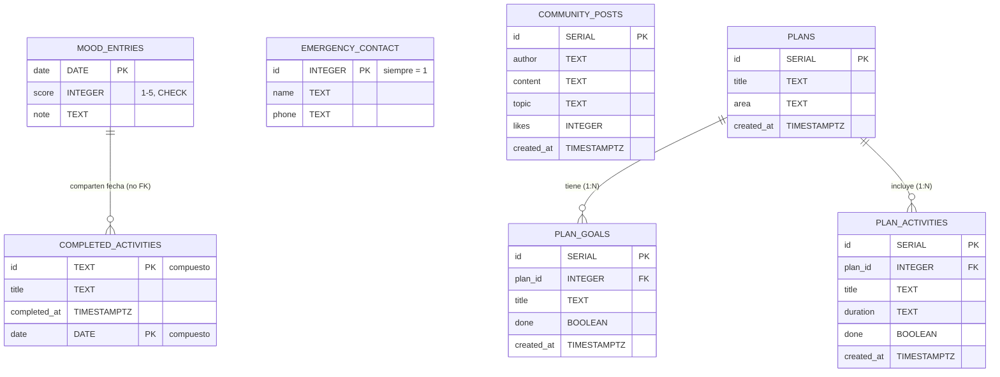

# ALIVIA — Modelo Entidad-Relación (ER)

Base de datos: **Neon PostgreSQL** · Esquema: `public` · Fuente: [`schema.sql`](./schema.sql)

## Diagrama ER

## Resumen de cardinalidades

| Relación | Desde | Hacia | Cardinalidad | Regla de borrado |
|---|---|---|---|---|
| Plan → Metas | `plans` | `plan_goals` | 1 : N | `ON DELETE CASCADE` |
| Plan → Actividades | `plans` | `plan_activities` | 1 : N | `ON DELETE CASCADE` |

El resto de tablas son **independientes** (no tienen llaves foráneas entre sí).

## Tablas

### `mood_entries` — Registro de ánimo (Radar de Bienestar)

| Columna | Tipo | Restricciones | Descripción |
|---|---|---|---|
| `date` | `DATE` | **PK** | Día del registro, formato `YYYY-MM-DD` (un registro por día) |
| `score` | `INTEGER` | NOT NULL, `CHECK (score BETWEEN 1 AND 5)` | Ánimo: 1 (muy abrumado) a 5 (en paz) |
| `note` | `TEXT` | opcional | Bitácora personal del día |

### `emergency_contact` — Contacto seguro (SOS)

| Columna | Tipo | Restricciones | Descripción |
|---|---|---|---|
| `id` | `INTEGER` | **PK**, `CHECK (id = 1)` | Siempre 1: fila única de contacto |
| `name` | `TEXT` | NOT NULL | Nombre de la persona de confianza |
| `phone` | `TEXT` | NOT NULL | Teléfono para llamada rápida |

### `completed_activities` — Actividades de afrontamiento completadas

| Columna | Tipo | Restricciones | Descripción |
|---|---|---|---|
| `id` | `TEXT` | **PK (compuesta)** | Id de la actividad (ej: `reset90`, `cold`) |
| `title` | `TEXT` | NOT NULL | Título de la actividad |
| `completed_at` | `TIMESTAMPTZ` | NOT NULL, default `now()` | Marca de tiempo exacta |
| `date` | `DATE` | **PK (compuesta)** | Día en que se completó (evita duplicados en el mismo día) |

### `community_posts` — Comunidad Global

| Columna | Tipo | Restricciones | Descripción |
|---|---|---|---|
| `id` | `SERIAL` | **PK** | Id autoincremental |
| `author` | `TEXT` | NOT NULL, default `'Anónimo'` | Autor (posiblemente anónimo) |
| `content` | `TEXT` | NOT NULL | Contenido del mensaje |
| `topic` | `TEXT` | opcional | Categoría (`bienestar`, `ansiedad`, `tristeza`, …) |
| `likes` | `INTEGER` | NOT NULL, default `0` | Contador de reacciones |
| `created_at` | `TIMESTAMPTZ` | NOT NULL, default `now()` | Fecha de publicación |

### `plans` — Planes de Progreso Personal

| Columna | Tipo | Restricciones | Descripción |
|---|---|---|---|
| `id` | `SERIAL` | **PK** | Id del plan |
| `title` | `TEXT` | NOT NULL | Nombre del plan (problema grande convertido en pasos) |
| `area` | `TEXT` | NOT NULL, default `'general'` | Área (educación, ansiedad, hábitos, relaciones…) |
| `created_at` | `TIMESTAMPTZ` | NOT NULL, default `now()` | Fecha de creación |

### `plan_goals` — Metas/objetivos de un plan

| Columna | Tipo | Restricciones | Descripción |
|---|---|---|---|
| `id` | `SERIAL` | **PK** | Id de la meta |
| `plan_id` | `INTEGER` | **FK → `plans(id)`**, NOT NULL, `ON DELETE CASCADE` | Plan al que pertenece |
| `title` | `TEXT` | NOT NULL | Objetivo pequeño y alcanzable |
| `done` | `BOOLEAN` | NOT NULL, default `false` | Estado de completado |
| `created_at` | `TIMESTAMPTZ` | NOT NULL, default `now()` | Fecha de creación |

### `plan_activities` — Actividades/hábitos de un plan

| Columna | Tipo | Restricciones | Descripción |
|---|---|---|---|
| `id` | `SERIAL` | **PK** | Id de la actividad |
| `plan_id` | `INTEGER` | **FK → `plans(id)`**, NOT NULL, `ON DELETE CASCADE` | Plan al que pertenece |
| `title` | `TEXT` | NOT NULL | Título de la actividad |
| `duration` | `TEXT` | opcional | Duración estimada (ej: `10 min`) |
| `done` | `BOOLEAN` | NOT NULL, default `false` | Estado de completado |
| `created_at` | `TIMESTAMPTZ` | NOT NULL, default `now()` | Fecha de creación |

## Notas de diseño

- **Sin usuario global**: la app es 100% anónima/individual; no hay tabla `users`. Cada dispositivo comparte el mismo almacenamiento de la BD.
- **`mood_entries.date` es PK** → un solo ánimo por día (upsert por conflicto).
- **`completed_activities` PK compuesta `(id, date)`** → imposible duplicar la misma actividad el mismo día.
- **`emergency_contact.id = 1`** → patrón de "fila única" con upsert.
- **Cascada en planes**: borrar un plan elimina sus metas y actividades automáticamente.
- Las relaciones entre tablas independientes se manejan **a nivel de lógica de aplicación** (ej: el Radar cruza `mood_entries` con `completed_activities` por fecha).