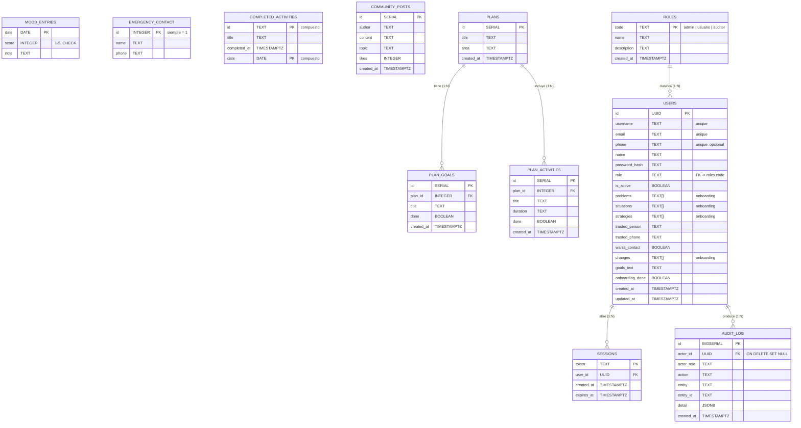

# ALIVIA — Modelo Entidad-Relación (ER)

Base de datos: **Neon PostgreSQL** · Esquema: `public` · Fuente: [`schema.sql`](./schema.sql)

## Mapa visual

| Archivo | Descripción |
|---|---|
| [`er-diagrama.png`](./er-diagrama.png) | Mapa ER en imagen (PNG), listo para compartir o imprimir |
| [`er-diagrama.svg`](./er-diagrama.svg) | Mapa ER vectorial (SVG): zoom infinito sin perder calidad |
| [`er-diagrama.html`](./er-diagrama.html) | Mapa ER interactivo: abre en el navegador, cambia de tema y descarga PNG/SVG |

## Diagrama ER

```mermaid
erDiagram
    MOOD_ENTRIES {
        date DATE PK
        score INTEGER "1-5, CHECK"
        note TEXT
    }

    EMERGENCY_CONTACT {
        id INTEGER PK "siempre = 1"
        name TEXT
        phone TEXT
    }

    COMPLETED_ACTIVITIES {
        id TEXT PK "compuesto"
        title TEXT
        completed_at TIMESTAMPTZ
        date DATE PK "compuesto"
    }

    COMMUNITY_POSTS {
        id SERIAL PK
        author TEXT
        content TEXT
        topic TEXT
        likes INTEGER
        created_at TIMESTAMPTZ
    }

    PLANS {
        id SERIAL PK
        title TEXT
        area TEXT
        created_at TIMESTAMPTZ
    }

    PLAN_GOALS {
        id SERIAL PK
        plan_id INTEGER FK
        title TEXT
        done BOOLEAN
        created_at TIMESTAMPTZ
    }

    PLAN_ACTIVITIES {
        id SERIAL PK
        plan_id INTEGER FK
        title TEXT
        duration TEXT
        done BOOLEAN
        created_at TIMESTAMPTZ
    }

    USERS {
        id UUID PK
        username TEXT "unique"
        email TEXT "unique"
        phone TEXT "unique, opcional"
        name TEXT
        password_hash TEXT
        role TEXT "FK -> roles.code"
        is_active BOOLEAN
        problems TEXT[] "onboarding"
        situations TEXT[] "onboarding"
        strategies TEXT[] "onboarding"
        trusted_person TEXT
        trusted_phone TEXT
        wants_contact BOOLEAN
        changes TEXT[] "onboarding"
        goals_text TEXT
        onboarding_done BOOLEAN
        created_at TIMESTAMPTZ
        updated_at TIMESTAMPTZ
    }

    ROLES {
        code TEXT PK "admin | usuario | auditor"
        name TEXT
        description TEXT
        created_at TIMESTAMPTZ
    }

    SESSIONS {
        token TEXT PK
        user_id UUID FK
        created_at TIMESTAMPTZ
        expires_at TIMESTAMPTZ
    }

    AUDIT_LOG {
        id BIGSERIAL PK
        actor_id UUID FK "ON DELETE SET NULL"
        actor_role TEXT
        action TEXT
        entity TEXT
        entity_id TEXT
        detail JSONB
        created_at TIMESTAMPTZ
    }

    PLANS ||--o{ PLAN_GOALS : "tiene (1:N)"
    PLANS ||--o{ PLAN_ACTIVITIES : "incluye (1:N)"
    USERS ||--o{ SESSIONS : "abre (1:N)"
    ROLES ||--o{ USERS : "clasifica (1:N)"
    USERS ||--o{ AUDIT_LOG : "produce (1:N)"
```

## Resumen de cardinalidades

| Relación | Desde | Hacia | Cardinalidad | Regla de borrado |
|---|---|---|---|---|
| Plan → Metas | `plans` | `plan_goals` | 1 : N | `ON DELETE CASCADE` |
| Plan → Actividades | `plans` | `plan_activities` | 1 : N | `ON DELETE CASCADE` |
| Usuario → Sesiones | `users` | `sessions` | 1 : N | `ON DELETE CASCADE` |
| Rol → Usuarios | `roles` | `users` | 1 : N | `RESTRICT` (la FK vive en `users.role`) |
| Usuario → Auditoría | `users` | `audit_log` | 1 : N | `ON DELETE SET NULL` (el evento sobrevive a la cuenta) |

Las tablas de contenido (`mood_entries`, `emergency_contact`, `completed_activities`, `community_posts`, `plans`) son **independientes** (no tienen llaves foráneas a `users`); cada usuario registrado comparte el mismo contenido global.

## Tablas

### `mood_entries` — Registro de ánimo (Radar de Bienestar)

| Columna | Tipo | Restricciones | Descripción |
|---|---|---|---|
| `date` | `DATE` | **PK** | Día del registro, formato `YYYY-MM-DD` (un registro por día) |
| `score` | `INTEGER` | NOT NULL, `CHECK (score BETWEEN 1 AND 5)` | Ánimo: 1 (muy abrumado) a 5 (en paz) |
| `note` | `TEXT` | opcional | Bitácora personal del día |

### `emergency_contact` — Contacto seguro (SOS)

| Columna | Tipo | Restricciones | Descripción |
|---|---|---|---|
| `id` | `INTEGER` | **PK**, `CHECK (id = 1)` | Siempre 1: fila única de contacto |
| `name` | `TEXT` | NOT NULL | Nombre de la persona de confianza |
| `phone` | `TEXT` | NOT NULL | Teléfono para llamada rápida |

### `completed_activities` — Actividades de afrontamiento completadas

| Columna | Tipo | Restricciones | Descripción |
|---|---|---|---|
| `id` | `TEXT` | **PK (compuesta)** | Id de la actividad (ej: `reset90`, `cold`) |
| `title` | `TEXT` | NOT NULL | Título de la actividad |
| `completed_at` | `TIMESTAMPTZ` | NOT NULL, default `now()` | Marca de tiempo exacta |
| `date` | `DATE` | **PK (compuesta)** | Día en que se completó (evita duplicados en el mismo día) |

### `community_posts` — Comunidad Global

| Columna | Tipo | Restricciones | Descripción |
|---|---|---|---|
| `id` | `SERIAL` | **PK** | Id autoincremental |
| `author` | `TEXT` | NOT NULL, default `'Anónimo'` | Autor (posiblemente anónimo) |
| `content` | `TEXT` | NOT NULL | Contenido del mensaje |
| `topic` | `TEXT` | opcional | Categoría (`bienestar`, `ansiedad`, `tristeza`, …) |
| `likes` | `INTEGER` | NOT NULL, default `0` | Contador de reacciones |
| `created_at` | `TIMESTAMPTZ` | NOT NULL, default `now()` | Fecha de publicación |

### `plans` — Planes de Progreso Personal

| Columna | Tipo | Restricciones | Descripción |
|---|---|---|---|
| `id` | `SERIAL` | **PK** | Id del plan |
| `title` | `TEXT` | NOT NULL | Nombre del plan (problema grande convertido en pasos) |
| `area` | `TEXT` | NOT NULL, default `'general'` | Área (educación, ansiedad, hábitos, relaciones…) |
| `created_at` | `TIMESTAMPTZ` | NOT NULL, default `now()` | Fecha de creación |

### `plan_goals` — Metas/objetivos de un plan

| Columna | Tipo | Restricciones | Descripción |
|---|---|---|---|
| `id` | `SERIAL` | **PK** | Id de la meta |
| `plan_id` | `INTEGER` | **FK → `plans(id)`**, NOT NULL, `ON DELETE CASCADE` | Plan al que pertenece |
| `title` | `TEXT` | NOT NULL | Objetivo pequeño y alcanzable |
| `done` | `BOOLEAN` | NOT NULL, default `false` | Estado de completado |
| `created_at` | `TIMESTAMPTZ` | NOT NULL, default `now()` | Fecha de creación |

### `plan_activities` — Actividades/hábitos de un plan

| Columna | Tipo | Restricciones | Descripción |
|---|---|---|---|
| `id` | `SERIAL` | **PK** | Id de la actividad |
| `plan_id` | `INTEGER` | **FK → `plans(id)`**, NOT NULL, `ON DELETE CASCADE` | Plan al que pertenece |
| `title` | `TEXT` | NOT NULL | Título de la actividad |
| `duration` | `TEXT` | opcional | Duración estimada (ej: `10 min`) |
| `done` | `BOOLEAN` | NOT NULL, default `false` | Estado de completado |
| `created_at` | `TIMESTAMPTZ` | NOT NULL, default `now()` | Fecha de creación |

### `users` — Cuentas y perfil de bienestar (Login / Registro)

| Columna | Tipo | Restricciones | Descripción |
|---|---|---|---|
| `id` | `UUID` | **PK**, default `gen_random_uuid()` | Identificador único |
| `username` | `TEXT` | UNIQUE, NOT NULL | Nombre de usuario (se guarda en minúsculas) |
| `email` | `TEXT` | UNIQUE, NOT NULL | Correo (se guarda en minúsculas) |
| `phone` | `TEXT` | UNIQUE, opcional | Teléfono registrado al crear la cuenta |
| `name` | `TEXT` | NOT NULL | Nombre visible (saludo en la app) |
| `password_hash` | `TEXT` | NOT NULL | Hash `scrypt` con sal (nunca se expone) |
| `role` | `TEXT` | NOT NULL, **FK → `roles(code)`**, default `'usuario'` | Rol del sistema: `admin`, `usuario` o `auditor` |
| `is_active` | `BOOLEAN` | NOT NULL, default `true` | Cuenta activa; en `false` el token deja de validar y el login responde 403 |
| `problems` | `TEXT[]` | default `'{}'` | Problemas con los que lucha (onboarding) |
| `situations` | `TEXT[]` | default `'{}'` | Cosas que está pasando (onboarding) |
| `strategies` | `TEXT[]` | default `'{}'` | Cómo desea luchar contra eso (onboarding) |
| `trusted_person` | `TEXT` | opcional | Persona de mayor confianza |
| `trusted_phone` | `TEXT` | opcional | Teléfono de esa persona |
| `wants_contact` | `BOOLEAN` | NOT NULL, default `false` | Consentimiento para contacto de acompañamiento |
| `changes` | `TEXT[]` | default `'{}'` | Cosas que desea cambiar (onboarding) |
| `goals_text` | `TEXT` | opcional | Texto libre adicional |
| `onboarding_done` | `BOOLEAN` | NOT NULL, default `false` | Indica si completó el primer inicio |
| `created_at` | `TIMESTAMPTZ` | NOT NULL, default `now()` | Fecha de registro |
| `updated_at` | `TIMESTAMPTZ` | NOT NULL, default `now()` | Última actualización |

### `sessions` — Sesiones de login

| Columna | Tipo | Restricciones | Descripción |
|---|---|---|---|
| `token` | `TEXT` | **PK** | Token de sesión (doble UUID), se envía como `Bearer` |
| `user_id` | `UUID` | **FK → `users(id)`**, NOT NULL, `ON DELETE CASCADE` | Dueño de la sesión |
| `created_at` | `TIMESTAMPTZ` | NOT NULL, default `now()` | Fecha de creación |
| `expires_at` | `TIMESTAMPTZ` | NOT NULL | Expira a los 30 días; las expiradas se limpian al crear una nueva |

### `roles` — Catálogo de roles del sistema (RBAC)

| Columna | Tipo | Restricciones | Descripción |
|---|---|---|---|
| `code` | `TEXT` | **PK** | `admin`, `usuario` o `auditor` (catálogo cerrado, sembrado con `ON CONFLICT DO NOTHING`) |
| `name` | `TEXT` | NOT NULL | Nombre legible (Administrador, Usuario, Auditor) |
| `description` | `TEXT` | NOT NULL | Qué puede hacer el rol, en una línea |
| `created_at` | `TIMESTAMPTZ` | NOT NULL, default `now()` | Fecha de siembra |

Es un **catálogo cerrado**: `users.role` es FK hacia aquí, así que insertar un rol nuevo exige
pasar por este INSERT, y cualquier valor fuera del catálogo es rechazado por la base. La matriz
de permisos fina (`users.manage`, `audit.read`, `stats.view`, `app.use`) vive en el código
(`api/auth/_roles.ts`) para poder testearla; la base garantiza los tres roles, el código
reparte lo que cada uno puede hacer.

### `audit_log` — Bitácora de acciones sensibles

| Columna | Tipo | Restricciones | Descripción |
|---|---|---|---|
| `id` | `BIGSERIAL` | **PK** | Id del evento |
| `actor_id` | `UUID` | **FK → `users(id)`**, `ON DELETE SET NULL` | Quién actuó (sobrevive borrado de la cuenta) |
| `actor_role` | `TEXT` | NOT NULL | Rol que tenía el actor al momento del cambio |
| `action` | `TEXT` | NOT NULL | `user.role_change`, `user.deactivate`, … |
| `entity` | `TEXT` | NOT NULL | Entidad afectada (`user`, …) |
| `entity_id` | `TEXT` | opcional | Id de la entidad afectada |
| `detail` | `JSONB` | NOT NULL, default `'{}'` | Contexto (ej: `{"from":"usuario","to":"auditor"}`) |
| `created_at` | `TIMESTAMPTZ` | NOT NULL, default `now()` | Momento exacto |

Se escribe **dentro de la misma transacción** del cambio (`fn_log_audit` la invoca desde
`fn_admin_update_user`): no existe el cambio sin su registro. Índices por
`created_at DESC` y `(action, created_at DESC)` para paginar la consulta del auditor.

## Notas de diseño

- **Cuentas**: `users` guarda credenciales + perfil de bienestar (onboarding). El login acepta **usuario o correo** como identificador.
- **Seguridad**: contraseñas con `scrypt` + sal aleatoria; las sesiones expiran a los 30 días y el `password_hash` nunca se devuelve al cliente.
- **Roles (RBAC)**: tres roles fijos (`admin`, `usuario`, `auditor`) con FK al catálogo `roles`. La API pide **permisos**, no roles, y la BD re-valida en `fn_admin_update_user`: nadie puede cambiarse su propio rol, desactivarse a sí mismo ni dejar el sistema sin un admin activo. Rol y estado cambian en una sola transacción y desactivar una cuenta borra sus sesiones.
- **Auditoría**: los cambios de roles y estados quedan en `audit_log` en la misma transacción, listos para `/api/admin/audit` (admin y auditor).
- **`mood_entries.date` es PK** → un solo ánimo por día (upsert por conflicto).
- **`completed_activities` PK compuesta `(id, date)`** → imposible duplicar la misma actividad el mismo día.
- **`emergency_contact.id = 1`** → patrón de "fila única" con upsert.
- **Cascada en planes**: borrar un plan elimina sus metas y actividades automáticamente.
- Las relaciones entre tablas independientes se manejan **a nivel de lógica de aplicación** (ej: el Radar cruza `mood_entries` con `completed_activities` por fecha).